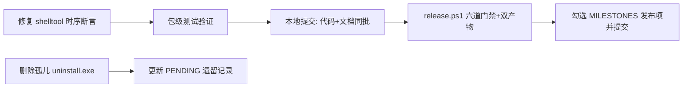

## 需求概述

继续处理 tiancode 项目中可自动化的未完成事项，范围经用户澄清确认：

### 核心内容

1. **shell 时序测试脆弱点修复**：`internal/platform/shelltool/shelltool_test.go` 中三个在并发负载下会假红的用例，按 `docs/PENDING.md:162` 已登记的判据修复——「固定 sleep + 单点断言」改为「轮询直到条件成立或超时」或语义化边界，语义不变、不放宽契约阈值

- `TestShellRun_TimeoutReturns`：`elapsed > 3s` 固定墙钟断言 → 改为相对语义边界（超时预算 700ms，命令本身约 10s，`res.TimedOut` 已证明机制收束）
- `TestShellRun_CancelKillsTree`：同款固定 3s 断言 → 同样语义化
- `TestShellRun_BackgroundLogBounded`：固定 `time.Sleep(1200ms)` 等突发输出写满 256B → 轮询 `bg_status` 直到日志含 `truncated` 或总超时

2. **0.2.0 发布**：执行 `scripts/release.ps1`（六步：gofmt/vet/test/arch_check 门禁 → 前端构建 → 应用 exe → Go 原生安装器 → 便携 zip → 产物清单），产物只在本地产出，不打 tag、不推送
3. **删除孤儿文件**（用户已明确批准）：删除 `%LOCALAPPDATA%\Programs\tiancode` 下 v0.0.1 孤儿 `uninstall.exe`（1.8MB，指向旧版卸载器，新安装器不使用）

### 边界

- 不做 R1 依赖图改造（用户明确排除）
- 人工 GUI 验收（M2 桌面端到端 / M5 快捷方式双击与弹框可见性 / 四环人工验收）无法自动化，不在本次范围，完成后仍保留
- 遵守仓库纪律：代码与文档同一批提交、文件行尾 LF、不做无关改动

### 视觉效果

无 UI 变更，纯测试修复 + 发布流水线执行 + 文档状态更新。

## 技术方案

### 技术栈

- 测试：Go 原生 `testing`（现有 `internal/platform/shelltool/shelltool_test.go`）
- 发布：`scripts/release.ps1`（PowerShell 5.1，ASCII-only，六道门禁 + 双产物）
- 文档：`docs/PENDING.md` / `docs/MILESTONES.md` / `docs/TESTING.md`
- 环境：本机 Go 在 `E:\pro\tools\go`、Node 在 `.workbuddy\binaries\node\versions\22.22.2-3`，均可能不在 PATH——执行 release 前需将其前置到本次会话 PATH（仅进程级，不改系统设置）

### 实现思路

1. **时序测试修复（最小改动，只动断言方式不动被测代码）**

- `TimeoutReturns` / `CancelKillsTree`：保留「超时/取消必须收束」契约（`res.TimedOut`），将固定 3s 墙钟改为**相对边界**——返回时间必须显著小于命令自然时长（`longCmd()` 约 10s），例如断言 `elapsed` 远小于 10s 并留足余量。语义等价：证明机制在预算内收束而非等命令跑完，且不依赖机器快慢
- `BackgroundLogBounded`：删除固定 1200ms sleep，改为轮询循环——每 ~200ms 调一次 `bg_status`，日志含 `truncated` 即满足；设总超时（如 10s）兜底，超时仍无 `truncated` 才判失败。任务仍必须回收（保留 defer `bg_kill`）
- 轮询辅助逻辑保持测试文件内私有函数，不引入新抽象层（YAGNI）

2. **验证策略**：`gofmt -l` 空输出 → `go test ./internal/platform/shelltool/ -count=1` 包级验证 → 有条件时模拟负载重跑（按 `docs/TESTING.md` 判据：负载下红不算回归、隔离重跑定论；本机 Go 偶发 std 解析错误属环境间歇拦截，允许重试）
3. **发布执行**：会话内前置工具链 PATH → `powershell -NoProfile -ExecutionPolicy Bypass -File scripts/release.ps1`，验证 `dist\tiancode-setup-v0.2.0.exe` 与 `dist\tiancode-v0.2.0-portable.zip` 产出；发布本身含全量门禁，即最终回归
4. **文档同步**：PENDING「已知脆弱点」第 1 条标记已修并记录修法；MILESTONES 勾选 `scripts/release.ps1 发布 0.2.0`（113 行）；TESTING 若判据表述需补充轮询模式则同步

### 架构设计



全部为局部改动：1 个测试文件 + 2~3 个文档 + 产物目录，零产线代码变更、零跨模块扩散。

### 目录结构

```
d:/weihu/tiancode/
├── internal/platform/shelltool/
│   └── shelltool_test.go        # [MODIFY] 三个用例断言方式改为语义化边界/轮询，新增测试内私有轮询辅助
├── docs/
│   ├── PENDING.md               # [MODIFY] 「已知脆弱点」第1条改为已修；「本轮遗留」孤儿文件条目标记已清理
│   ├── MILESTONES.md            # [MODIFY] 勾选 M6 发布 0.2.0（:113）
│   └── TESTING.md               # [MODIFY]（仅在判据需补充轮询模式时）补充轮询式时序断言写法
├── dist/                        # [NEW 产物] tiancode-setup-v0.2.0.exe、tiancode-v0.2.0-portable.zip
└── build/                       # [NEW 产物] tiancode.exe（发布中间产物）
```

### 关键注意事项

- 不放宽契约阈值、不删除断言、不改被测产线代码
- git 已与 origin/main 同步且工作区干净；本次只本地提交，不推送、不打 tag
- 删除孤儿文件前先确认目标路径存在且确为 v0.0.1 残留（指向旧版卸载器）

## Agent Extensions

### Skill

- **verification-before-completion**
- Purpose: 在声称「测试已修好」「发布成功」前，强制以真实命令输出为证据（gofmt/vet/test/release 产物清单），杜绝无证据的成功声明
- Expected outcome: 每个完成项均有可复核的命令输出支撑（测试 ok、产物存在且大小合理）