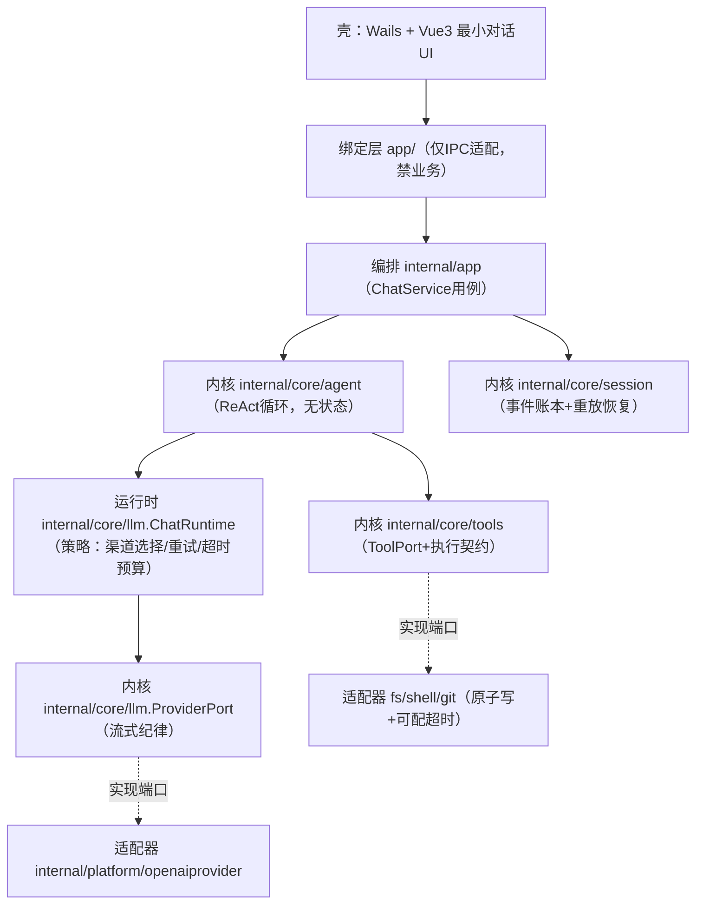

# 架构（ARCHITECTURE）

> tiancode 从零重建版架构。依赖严格单向，壳可替换。本文随模块落地同 PR 更新。

## 分层总览



## 依赖规则

| 层 | 位置 | 允许依赖 | 禁止 |
| --- | --- | --- | --- |
| 壳 | `main.go`、`app/` | `internal/app`、wails | 业务规则 |
| 编排 | `internal/app` | `internal/core/*` | 直接执行 IO |
| 内核 | `internal/core/*` | 仅 stdlib + core 内端口 | import 适配器/壳/编排 |
| 适配器 | `internal/platform` | core 端口 + stdlib + 单一外部依赖 | import 编排/壳 |

由 `scripts/arch_check.ps1` R1 强制。

## 目录说明

```
tiancode/
├── main.go                    # [M2] Wails 启动，薄
├── app/                       # [M2] Wails 绑定适配层（壳）
├── internal/
│   ├── app/                   # 编排：对话/会话用例（错误必须上抛）
│   ├── core/
│   │   ├── agent/             # ReAct 循环（无状态，M2 实现）
│   │   ├── llm/               # ProviderPort + StreamChunk/EndReason 契约
│   │   ├── tools/             # ToolPort + ToolResult 执行契约
│   │   └── session/           # 事件账本 + 重放恢复（M1 实现）
│   └── platform/              # 适配器：openaiprovider[M2] / atomicfile[M1] / shell,git,fs[M3-M4]
├── frontend/                  # Vue3 + Tailwind4 最小对话 UI（M2 展开）
├── docs/                      # 文档体系（见 STANDARDS.md §4）
├── scripts/arch_check.ps1     # 架构守卫 R1-R4
├── .gitignore                 # 提交纪律强制
├── .golangci.yml              # 注释/风格门禁
└── go.mod + vendor/           # vendor 保证离线可构建
```

## 模块职责

| 模块 | 职责 | 关键契约 |
| --- | --- | --- |
| `core/llm` | 供应商端口、ChatRuntime 运行时抽象与流式行为契约；不做 HTTP | 流式三终态（C-LLM-*）+ 运行时纪律（C-RT-*） |
| `core/session` | 追加式事件账本；崩溃重放恢复 | 账本即事实源（C-SES-*） |
| `core/tools` | 工具端口与执行契约 | 超时/部分输出/错误表达（C-TOOL-*） |
| `core/agent` | 无状态 ReAct 循环，步数上限 25 | 只编排端口，自身零 IO |
| `internal/app` | 用例编排；错误上抛 UI | 禁止 `_ =` 吞错（守卫 R2） |
| `platform/openaiprovider` | OpenAI 兼容流式适配器 | 实现流式纪律（M2） |
| `platform/*` 其余 | 原子写 / 进程执行 / 工具适配 | 原子性 + 可配超时（M1/M3/M4） |

## 对话主线数据流（M2 完成后）

```
用户输入 → app/ 绑定 → ChatService.Send（Pipeline：ResolveSession→Dispatch→StreamRelay→Persist，见 ADR-0005）
  → session 账本追加 UserMessage（持久化成功才推进内存）
  → agent.Loop（Phase 状态机 Idle/Running/Cancelled）
      → llm.ChatRuntime（流前重试，流中不换渠道）→ ProviderPort.StreamChat（空闲看门狗/发送逃生）
      ├─ Delta → 账本 AssistantDelta → 前端流式渲染
      ├─ ToolCall → tools.ToolPort.Execute（超时契约）→ 账本 ToolCall/ToolResult → 前端工具卡片
      └─ 终态 EndReason → 账本 AssistantMsg/TurnEnd → 前端终态标签
取消 → ctx.Done → EndCancelled 终态，账本保留已产生事件
```

## 设计风格

极简开发者暗色 + 精致微动效。令牌：主色 `#3B82F6`，背景 `#0D1117/#161B22`，文字 `#E6EDF3/#8B949E`，功能色 `#3FB950/#F85149/#D29922`。前端单一定义源：`frontend/src/style.css`。

## 参照来源

- 流式纪律：new-api `relay/helper/stream_scanner.go`（legacy 可查旧分析，或见 `adr/0003-stream-discipline.md`）
- 事件账本与 SSE 协议：dsh-java SessionLog / 四帧协议
- 端口-适配器分层：dsh-java 六边形架构（教训：只借分层，不借 27 上下文仪式）
